# Kubernetes on Azure — Self-Managed Cluster

Deploy a production-ready, self-managed Kubernetes cluster on Azure virtual machines using Terraform and cloud-init. This project provisions all required infrastructure and automates node bootstrapping with `kubeadm`, using **Calico** as the CNI and **cloud-provider-azure** for native Azure integration.

---

## Table of Contents

- [Architecture](#architecture)
- [Prerequisites](#prerequisites)
- [Project Structure](#project-structure)
- [Quick Start](#quick-start)
- [Configuration Reference](#configuration-reference)
- [Security Considerations](#security-considerations)
- [Cluster Components](#cluster-components)
- [Troubleshooting](#troubleshooting)
- [Contributing](#contributing)

---

## Architecture



---

## Prerequisites

| Tool | Version | Notes |
|---|---|---|
| [Terraform](https://developer.hashicorp.com/terraform/install) | ≥ 1.5 | Infrastructure provisioning |
| [Azure CLI](https://learn.microsoft.com/en-us/cli/azure/install-azure-cli) | latest | Authentication |
| [kubectl](https://kubernetes.io/docs/tasks/tools/) | ≥ 1.29 | Cluster management |
| [Helm](https://helm.sh/docs/intro/install/) | ≥ 3.x | Chart installations |
| SSH key pair | — | `~/.ssh/id_rsa` + `~/.ssh/id_rsa.pub` |

**Azure permissions required:** Contributor role on the target subscription (to create VMs, VNets, NSGs, and Public IPs).

---

## Project Structure

```
.
├── main.tf                         # Azure infrastructure resources
├── variables.tf                    # Input variable definitions
├── outputs.tf                      # Terraform outputs (public IPs)
├── setup-cluster.sh                # Post-provision cluster setup script
└── cloud-init/
    ├── control-plane.yaml          # Bootstrap script for control plane VM
    └── worker.yaml                 # Bootstrap script for worker VM
```

---

## Quick Start

### 1. Clone and configure

```bash
git clone <your-repo-url>
cd <repo-directory>
```

Create a `terraform.tfvars` file with your values:

```hcl
subscription_id  = "xxxxxxxx-xxxx-xxxx-xxxx-xxxxxxxxxxxx"
allowed_ssh_cidr = "203.0.113.10/32"   # your public IP
```

> **Important:** Never commit `terraform.tfvars` to version control if it contains sensitive values. Add it to `.gitignore`.

### 2. Provision infrastructure

```bash
# Authenticate with Azure
az login

# Initialise Terraform
terraform init

# Preview the changes
terraform plan

# Apply — this provisions both VMs
terraform apply
```

Note the public IP outputs:

```
control_plane_public_ip = "20.x.x.x"
worker_public_ip        = "20.x.x.y"
```

### 3. Wait for cloud-init to complete

The VMs run cloud-init on first boot to install `containerd`, `kubelet`, `kubeadm`, and `kubectl`. This typically takes **3–5 minutes**. You can monitor progress via:

```bash
ssh azureuser@<CPLANE_IP> "sudo tail -f /var/log/cloud-init-output.log"
```

### 4. Set up the cluster

Edit `setup-cluster.sh` and fill in the two required variables at the top:

```bash
CPLANE_IP="20.x.x.x"   # from terraform output
WORKER_IP="20.x.x.y"   # from terraform output
```

Then run the script:

```bash
chmod +x setup-cluster.sh
./setup-cluster.sh
```

The script will:
1. Initialise the control plane with `kubeadm`
2. Download `admin.conf` to your local machine
3. Fetch a fresh join token (no hardcoded secrets)
4. Join the worker node to the cluster
5. Install `cloud-provider-azure` and `Calico` via Helm

### 5. Verify

```bash
export KUBECONFIG=$(readlink -f admin.conf)
kubectl get nodes
```

Expected output:

```
NAME               STATUS   ROLES           AGE   VERSION
control-plane-vm   Ready    control-plane   5m    v1.29.x
worker-vm          Ready    <none>          2m    v1.29.x
```

---

## Configuration Reference

| Variable | Default | Description |
|---|---|---|
| `subscription_id` | — | **Required.** Azure subscription ID |
| `resource_group_name` | `k8s-rg` | Name of the resource group |
| `location` | `eastus` | Azure region |
| `vnet_cidr` | `10.0.0.0/8` | Virtual network address space |
| `control_plane_subnet_cidr` | `10.0.0.0/16` | Control plane subnet CIDR |
| `worker_subnet_cidr` | `10.1.0.0/16` | Worker subnet CIDR |
| `vm_size` | `Standard_B2s` | VM SKU for both nodes |
| `admin_username` | `azureuser` | SSH admin user on VMs |
| `ssh_public_key_path` | `~/.ssh/id_rsa.pub` | Path to your SSH public key |
| `allowed_ssh_cidr` | `0.0.0.0/0` |  Restrict this to your IP |

---

## Security Considerations

> **This project is intended for learning and development.** Review all points below before using in production.

**Restrict network access**
Set `allowed_ssh_cidr` to your specific IP address (`x.x.x.x/32`) rather than leaving it open to the internet. Port 6443 (Kubernetes API) should be similarly restricted.

**Do not hardcode credentials**
The `azure.json` file in `control-plane.yaml` contains placeholder values for `tenantId`, `aadClientId`, and `aadClientSecret`. In production, inject these via:
- Azure Managed Identity (preferred — eliminates the need for client secrets entirely)
- Azure Key Vault with a Terraform `data` source
- CI/CD pipeline secrets (GitHub Actions, Azure DevOps)

**Rotate bootstrap tokens**
`kubeadm` bootstrap tokens expire after 24 hours by default. The `setup-cluster.sh` script generates a fresh token at runtime — never save or commit these values.

**Kubeconfig security**
The downloaded `admin.conf` grants full cluster-admin access. Store it securely and restrict file permissions:

```bash
chmod 600 admin.conf
```

---

## Cluster Components

### cloud-provider-azure
Enables native Azure integration so Kubernetes can manage Azure resources such as Load Balancers and route tables on behalf of the cluster.

```bash
helm install \
  --repo https://raw.githubusercontent.com/kubernetes-sigs/cloud-provider-azure/master/helm/repo \
  cloud-provider-azure --generate-name \
  --set cloudControllerManager.clusterCIDR="192.168.0.0/16"
```

### Calico (CNI)
Provides pod networking and network policy enforcement. Installed via the Tigera Operator Helm chart.

```bash
helm repo add projectcalico https://docs.tigera.io/calico/charts
helm install calico projectcalico/tigera-operator \
  --version v3.27.3 \
  --namespace tigera-operator --create-namespace
```

---

## Troubleshooting

**cloud-init didn't finish / packages not installed**
```bash
ssh azureuser@<IP> "sudo cat /var/log/cloud-init-output.log"
```

**kubeadm init failed**
```bash
ssh azureuser@<CPLANE_IP> "sudo journalctl -xeu kubelet"
```

**Worker node stuck in NotReady**

Calico may still be initialising. Wait ~60 seconds, then:
```bash
kubectl get pods -n calico-system
kubectl describe node worker-vm
```

**Reset a node and try again**
```bash
ssh azureuser@<IP> "sudo kubeadm reset -f && sudo rm -rf /etc/kubernetes /var/lib/kubelet"
```

**Cannot reach the API server from local machine**

Ensure port `6443` is open in the control plane NSG and that `allowed_ssh_cidr` includes your current IP. Verify with:
```bash
curl -k https://<CPLANE_IP>:6443/healthz
```

---

## Note

inspired by this article: https://medium.com/@nabil.abdi/managed-identity-for-self-managed-kubernetes-cluster-in-azure-1f0511d6a527